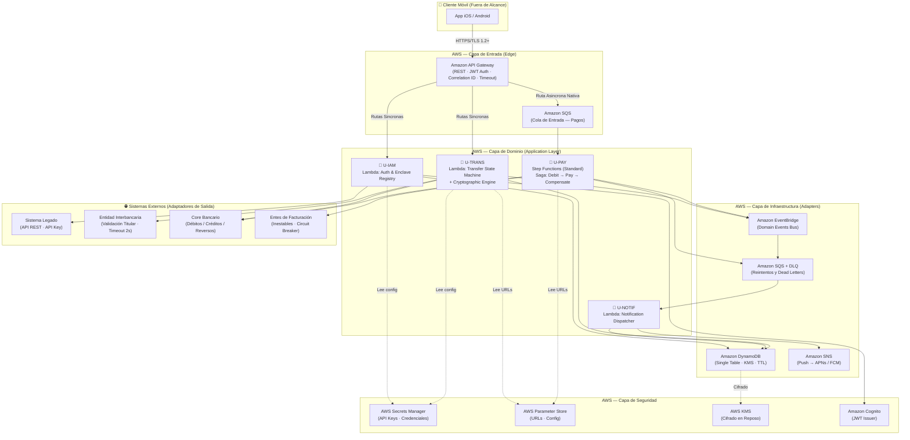
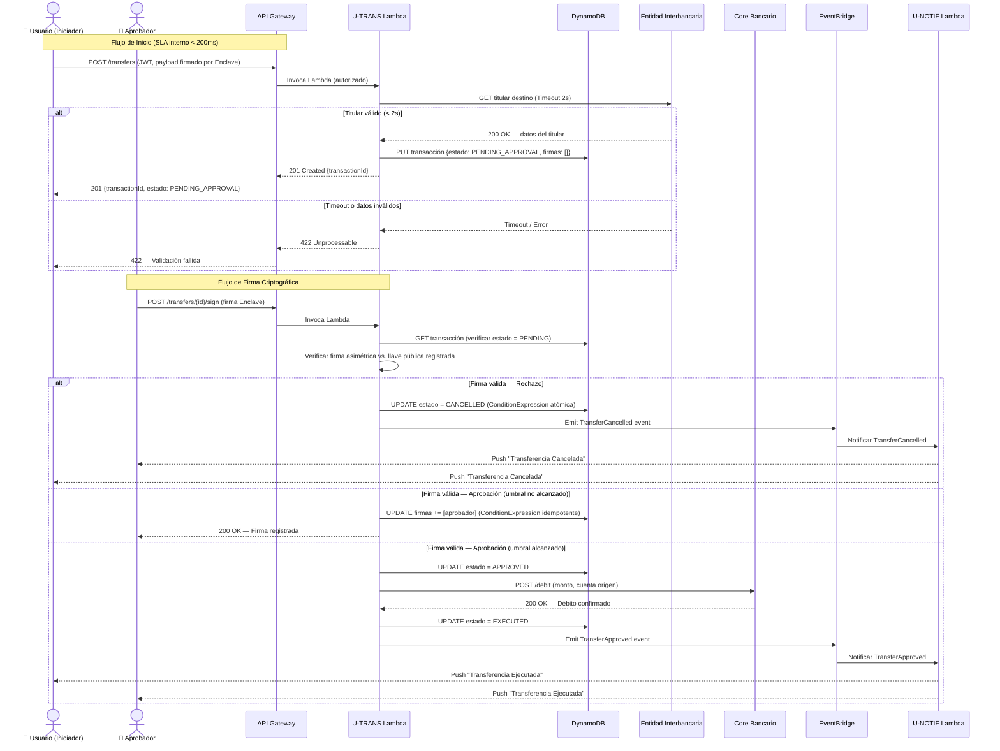
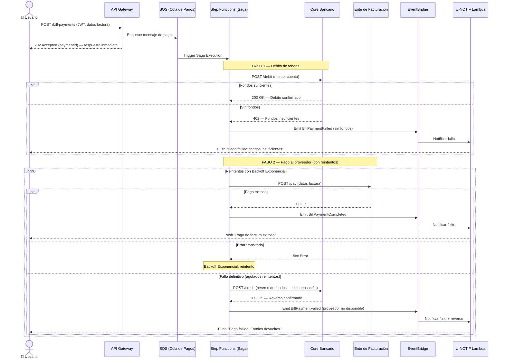
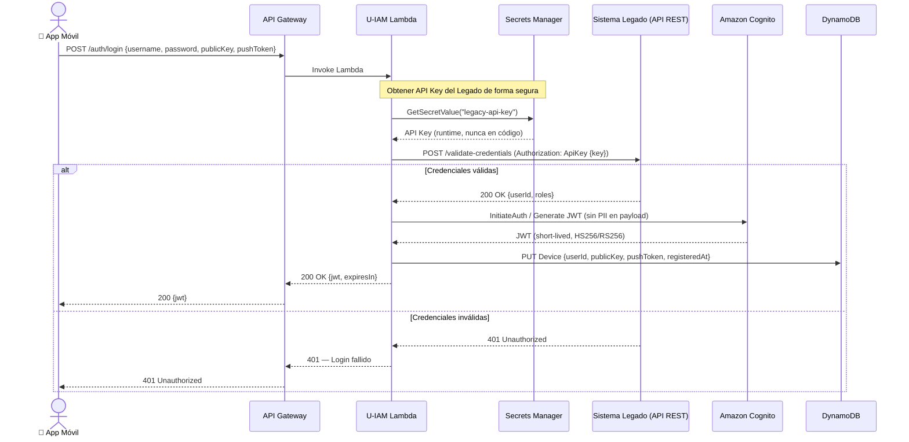
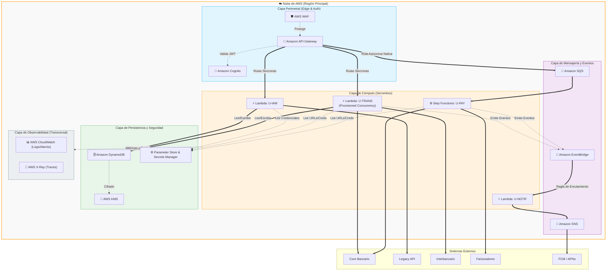

# Reingeniería de Backend — App Móvil Bancaria Empresarial

> **Proyecto:** Reingeniería Cloud-Native de la aplicación móvil de banca empresarial.  
> **Metodología:** AI Development Lifecycle (AI-DLC) — Mob Elaboration completado.  
> **Estado:** ✅ Elaboración Completa · Plan Validado (PASS) · Listo para Construcción.

---

## 🗺️ Índice de Documentación

| Sección | Documento | Estado |
|---------|-----------|--------|
| [Intención y Alcance](#1-intención-y-alcance) | [intent-primary.md](aidlc-docs/intents/intent-primary.md) | ✅ Completo |
| [Enterprise Guardrails (EGS)](#2-enterprise-guardrail-system-egs) | [egs_definition.md](aidlc-docs/standards/egs_definition.md) | ✅ Completo |
| [Historias de Usuario](#3-historias-de-usuario) | [user_stories.md](aidlc-docs/mob-elaboration/user_stories.md) | ✅ Completo |
| [División de Unidades (Bounded Contexts)](#4-bounded-contexts--unidades-lógicas) | [units.md](aidlc-docs/mob-elaboration/units.md) | ✅ Completo |
| [Riesgos y NFRs](#5-riesgos-y-requerimientos-no-funcionales) | [risks_and_nfrs.md](aidlc-docs/mob-elaboration/risks_and_nfrs.md) | ✅ Completo |
| [Plan de Bolts (Entrega)](#6-plan-de-entrega-bolts) | [bolt_plan.md](aidlc-docs/mob-elaboration/bolt_plan.md) | ✅ Completo |
| [Registro de Decisiones](#7-registro-de-decisiones-arquitectónicas-d1--d9) | [decision-log.md](aidlc-docs/decisions/decision-log.md) | ✅ Completo |
| [Stack Tecnológico](#8-stack-tecnológico-y-servicios-aws) | Esta sección | ✅ Completo |
| [Diagramas](#9-diagramas-de-arquitectura) | Esta sección | ✅ Completo |
| [Diagrama de Clases](#10-diagrama-de-clases-del-dominio) | Esta sección | ✅ Completo |
| [Auditoría de Sesión](#11-auditoría-de-sesión) | [audit-log.md](aidlc-docs/audit/audit-log.md) | ✅ Completo |

---

## 1. Intención y Alcance

**Documento:** [`intent-primary.md`](aidlc-docs/intents/intent-primary.md)

### ¿Qué problema resolvemos?

El sistema bancario actual sufre **alta latencia** producida por múltiples saltos en capas legadas, **contención de infraestructura** causada por integraciones síncronas con proveedores externos de facturación inestables, y **carece de un modelo robusto** de validación criptográfica para las transferencias corporativas.

### Objetivo

Diseñar e implementar una arquitectura **Cloud-Native, Serverless y Event-Driven** sobre AWS, usando **Clean Architecture (Hexagonal)** para aislar el dominio de negocio de la infraestructura. La solución debe:

- Eliminar los saltos intermedios de latencia.
- Desacoplar las dependencias externas inestables mediante patrones asíncronos.
- Proveer un modelo de seguridad avanzado con **Firma Criptográfica de Enclave Seguro** y cumplimiento estricto de **PCI-DSS**.

### Actores del Sistema

| Actor | Rol |
|-------|-----|
| **Usuario Corporativo (Iniciador)** | Inicia transferencias y pagos de facturas. |
| **Usuario Corporativo (Aprobador)** | Firma criptográficamente transacciones pendientes. Cualquier aprobador puede firmar. Un solo rechazo aborta la transacción. |
| **Core Bancario** | Sistema externo para débitos, créditos y reversos de fondos. |
| **Sistema Legado de Credenciales** | API REST de autenticación del portal actual. Integrado vía ACL + API Key. |
| **Entidades Interbancarias** | API de validación de titularidad de cuentas destino. |
| **Entes de Facturación** | Proveedores externos para pago de facturas (considerados inestables). |

### Fuera de Alcance

- Desarrollo o modificación de las aplicaciones móviles (iOS / Android). Es un proyecto estrictamente de **reingeniería de backend**.
- Modificaciones estructurales al Core Bancario o al sistema Legado.

---

## 2. Enterprise Guardrail System (EGS)

**Documento:** [`egs_definition.md`](aidlc-docs/standards/egs_definition.md)

Durante la sesión de elaboración, establecimos que **ningún artifact de construcción puede ignorar estos guardrails**. Constituyen el contrato técnico no negociable del proyecto.

### Resumen de las 5 Categorías

| Categoría | Regla Clave |
|-----------|------------|
| **1. Seguridad & Identidad** | Zero Trust end-to-end. TLS 1.2+ obligatorio. Cifrado en reposo (KMS). Secrets en AWS Secrets Manager. |
| **2. Arquitectura de Software** | Clean Architecture Hexagonal. EDA para flujos asíncronos. Anti-Corruption Layer para el legado. |
| **3. Resiliencia** | SLA interno < 200ms. Fail-Fast Timeout para externos. Circuit Breaker + DLQ + Backoff Exponencial. |
| **4. Observabilidad (PCI-DSS)** | Audit Trails inmutables por transacción. Prohibido PII en logs. Correlation IDs desde API Gateway. |
| **5. Infraestructura** | Serverless-First (Lambda, DynamoDB, SQS). 100% IaC (CDK/Terraform). Prohibido ClickOps. |

---

## 3. Historias de Usuario

**Documento:** [`user_stories.md`](aidlc-docs/mob-elaboration/user_stories.md)

Las historias fueron generadas con perfil **THOROUGH** y cada Criterio de Aceptación (AC) hace referencia explícita a los NFR-IDs del registro de riesgos y a los controles de PCI-DSS. No son historias de UI; todas son de backend puro.

| Historia | Nombre | Bounded Context | NFRs |
|----------|--------|-----------------|------|
| **ST-01** | Autenticación, Registro de Enclave y Push Tokens | U-IAM | NFR-02 |
| **ST-02** | Inicio de Transferencia Interbancaria y Validación Síncrona | U-TRANS | NFR-01, NFR-02, NFR-03, NFR-04 |
| **ST-03** | Aprobación/Rechazo Multi-firma (Enclave Seguro) | U-TRANS | NFR-03 |
| **ST-04** | Pago de Facturas Asíncrono y Compensación (Saga) | U-PAY | NFR-04 |
| **ST-05** | Sistema Centralizado de Notificaciones Push | U-NOTIF | NFR-02 |

---

## 4. Bounded Contexts / Unidades Lógicas

**Documento:** [`units.md`](aidlc-docs/mob-elaboration/units.md)

Las 5 historias se agruparon en **4 Bounded Contexts** siguiendo los principios de Domain-Driven Design (DDD). Cada contexto es un microservicio **independiente y desacoplado**, de forma que la inestabilidad de un ente externo no propague fallas en cascada a los demás.

| Unidad | Servicio | Responsabilidad de Dominio |
|--------|----------|---------------------------|
| **U-IAM** | Identity & Security Context | Autenticación Zero Trust, llaves de Enclave y mapeo de Push Tokens. |
| **U-TRANS** | Transfers & Multi-sig Context | Motor de estados de transferencias y validación criptográfica de firmas. |
| **U-PAY** | Async Payments Context | Orquestación Saga para el ciclo de vida de pagos de facturas. |
| **U-NOTIF** | Notifications Context | Consumidor de eventos de dominio y despachador de notificaciones Push. |

---

## 5. Riesgos y Requerimientos No Funcionales

**Documento:** [`risks_and_nfrs.md`](aidlc-docs/mob-elaboration/risks_and_nfrs.md)

Se identificaron **5 NFRs** y **4 riesgos críticos** que moldean directamente las decisiones de infraestructura.

### NFRs Clave

| ID | Requerimiento |
|----|--------------|
| **NFR-01** | Procesamiento interno < 200ms (p99) para operaciones síncronas. |
| **NFR-02** | Cumplimiento PCI-DSS. Cifrado TLS 1.2+ y en reposo (KMS). Sin PII en logs. |
| **NFR-03** | Audit Trails 100% de operaciones de transferencia y firma. |
| **NFR-04** | Aislamiento de componentes externos (Circuit Breaker + DLQ). |
| **NFR-05** | Escalabilidad elástica sin pre-provisionamiento (Serverless). |

### Riesgos Críticos y Mitigaciones

| ID | Riesgo | Impacto | Mitigación Clave |
|----|--------|---------|-----------------|
| **R-01** | Dependencia externa lenta rompe el SLA de 200ms. | Alto | Fail-Fast Timeout (2s) + Circuit Breaker en adaptadores. |
| **R-02** | Saga inconsistente deja fondos bloqueados tras fallo de nube. | Crítico | Step Functions **Standard Mode** (persiste estado). |
| **R-03** | Dispositivo perdido/robado, llave de Enclave sigue activa. | Alto | Endpoint de revocación explícita en U-IAM. |
| **R-04** | Fuga accidental de PII/JWT en logs de CloudWatch. | Crítico | Logger Middleware con scrubbing automático de campos sensibles. |
| **R-05** | Latencia por Cold Start de Lambdas rompe el SLA <200ms. | Medio | **Provisioned Concurrency** en AWS Lambda para flujos síncronos (`U-TRANS`). |

---

## 6. Plan de Entrega (Bolts)

**Documento:** [`bolt_plan.md`](aidlc-docs/mob-elaboration/bolt_plan.md)

El plan de construcción tiene **5 Bolts** secuenciales. Se construyen de la capa base (Identidad) hacia las capas superiores (Pagos y Notificaciones), garantizando que cada bolt tenga sus dependencias resueltas antes de comenzar.

| Bolt | Servicio | Esfuerzo | Depende de |
|------|----------|----------|-----------|
| **B-01** | Core Auth & Enclave Registry (U-IAM) | 12h | — |
| **B-02** | Transfer State Machine & Sync Validation (U-TRANS) | 14h | B-01 |
| **B-03** | Multi-sig Cryptographic Engine (U-TRANS) | 16h | B-01, B-02 |
| **B-04** | Async Bill Payment Saga (U-PAY) | 16h | B-01 |
| **B-05** | Centralized Notification Engine (U-NOTIF) | 8h | B-03, B-04 |

**Total estimado: 66 horas.** Validación de Plan: ✅ **PASS**.

---

## 7. Registro de Decisiones Arquitectónicas (D1 – D9)

**Documento:** [`decision-log.md`](aidlc-docs/decisions/decision-log.md)

Durante la sesión de Mob Elaboration se tomaron **9 decisiones arquitectónicas** irreversibles o de alto costo de cambio. Estas decisiones deben ser respetadas en toda la fase de construcción. Si la construcción necesita cambiar alguna, debe actualizar primero este registro.

| ID | Decisión | Razón / Alternativa Rechazada |
|----|----------|-------------------------------|
| **D1** | Firma asimétrica de Enclave Seguro (no TOTP) | Mayor seguridad criptográfica; TOTP es vulnerable a intercepción del código. |
| **D2** | Backend AWS gestiona Push Tokens (no el Legado) | Desacoplamiento total del legado; permite evolucionar el canal de notificaciones. |
| **D3** | Un solo rechazo aborta la multi-firma | Reduce el riesgo financiero; no esperar a que todos respondan. |
| **D4** | Saga Asíncrona Opción B (Débito → Pago → Reverso) | Evita bloqueo en la UI; toda la orquestación delega a Step Functions. |
| **D5** | SLA interno < 200ms (no End-to-End) | End-to-End rechazado: dependencia de proveedores externos fuera de nuestro control. |
| **D6** | Legado integrado por API Key en Secrets Manager | El Legado no soporta IAM/OAuth; la API Key se inyecta en runtime de forma segura. |
| **D7** | DynamoDB como motor de persistencia (no Aurora) | Latencia de 1 dígito de milisegundo; Aurora Serverless tiene cold start no aceptable. |
| **D8** | Core Bancario es un actor explícito del sistema | Sin él, no hay cómo ejecutar el débito final ni el reverso de fondos de la Saga. |
| **D9** | URLs en Parameter Store, credenciales en Secrets Manager | Separación de concerns de configuración vs. seguridad; exigencia PCI-DSS. |

---

## 8. Stack Tecnológico y Servicios AWS

### Capa de API (Entrada / Ports IN)

| Servicio | Uso |
|----------|-----|
| **Amazon API Gateway (REST)** | Gateway principal. Autorización JWT (Lambda Authorizer). Correlation IDs. Timeout de integración configurable. |
| **Amazon SQS** | Cola de entrada para el flujo asíncrono de pagos de facturas (U-PAY). |

### Capa de Cómputo (Dominio / Application)

| Servicio | Uso |
|----------|-----|
| **AWS Lambda** | Motor de ejecución para todos los Bounded Contexts. Runtime: **Node.js 20.x** o **Python 3.12** (por definir en construcción). |
| **AWS Step Functions (Standard Mode)** | Orquestador del Patrón Saga para U-PAY. Garantiza persistencia de estado hasta 1 año. |

### Capa de Persistencia (Ports OUT — Data)

| Servicio | Uso |
|----------|-----|
| **Amazon DynamoDB** | Single Table Design para todas las entidades de dominio: transacciones, firmas, llaves públicas, push tokens. |

### Capa de Mensajería y Eventos (Ports OUT — Events)

| Servicio | Uso |
|----------|-----|
| **Amazon EventBridge** | Bus de eventos de dominio (`TransferApproved`, `BillPaymentFailed`, etc.). Desacoplamiento entre bounded contexts. |
| **Amazon SQS + Dead Letter Queue (DLQ)** | Resiliencia para el procesamiento de eventos y reintentos en U-NOTIF. |
| **Amazon SNS** | Fan-out de notificaciones push hacia APNs (iOS) y FCM (Android). |

### Capa de Seguridad

| Servicio | Uso |
|----------|-----|
| **AWS Secrets Manager** | Almacenamiento de API Keys (Legado, Core Bancario, Interbancarios). Rotación automática. |
| **AWS Systems Manager Parameter Store** | URLs y configuraciones de todos los sistemas externos. |
| **AWS KMS** | Cifrado en reposo de los ítems sensibles en DynamoDB. |
| **Amazon Cognito / Lambda Authorizer** | Emisión y validación de JWT de corta duración. |

### Capa de Observabilidad

| Servicio | Uso |
|----------|-----|
| **AWS CloudWatch Logs** | Logs estructurados (JSON) con Correlation ID. Scrubbing de PII mediante Logger Middleware. |
| **AWS X-Ray** | Trazabilidad distribuida entre Lambdas y Step Functions para detección de cuellos de botella. |
| **CloudWatch Alarms** | Alertas sobre latencia (>180ms, SLA warning), errores de Circuit Breaker y tamaño de DLQs. |

### Infraestructura como Código

| Herramienta | Uso |
|-------------|-----|
| **AWS CDK (Python)** | Definición de toda la infraestructura (Lambdas, DynamoDB, SQS, API GW, Step Functions). Prohibido ClickOps. |

---

## 9. Diagramas de Arquitectura

### 9.1 Diagrama de Capas Técnicas

### 9.2 Diagrama de Secuencia — Transferencia Interbancaria con Multi-firma

### 9.3 Diagrama de Secuencia — Pago de Factura (Saga Pattern)

### 9.4 Diagrama de Secuencia — Autenticación y Registro de Enclave

### 9.5 Diagrama de Infraestructura Cloud (Topología AWS Serverless)

Este diagrama representa el despliegue físico de los servicios dentro de la nube de AWS, enfocándose en cómo interactúan los componentes Serverless gestionados, la capa de seguridad y las redes.

---

## 10. Diagrama de Clases del Dominio

> Este diagrama muestra la estructura de clases del dominio **puro** (núcleo hexagonal), sin referencias a infraestructura. Las implementaciones concretas de los puertos vivirán en la capa de adaptadores.

```mermaid
classDiagram
    class Transaction {
        +String transactionId
        +String initiatorId
        +String destinationAccount
        +Decimal amount
        +String currency
        +TransactionStatus status
        +List~Signature~ signatures
        +Integer requiredSignatures
        +DateTime createdAt
        +DateTime updatedAt
        +void sign(Signature sig)
        +void reject(String rejectorId)
        +boolean hasReachedThreshold()
        +void execute()
        +void cancel()
    }

    class TransactionStatus {
        <<enumeration>>
        PENDING_APPROVAL
        APPROVED
        CANCELLED
        EXECUTED
        FAILED
    }

    class Signature {
        +String signatureId
        +String approverId
        +String transactionId
        +String cryptographicProof
        +SignatureAction action
        +DateTime signedAt
        +boolean verify(PublicKey key, String payload)
    }

    class SignatureAction {
        <<enumeration>>
        APPROVED
        REJECTED
    }

    class DeviceRegistration {
        +String deviceId
        +String userId
        +String publicKeyPem
        +String pushToken
        +PushPlatform platform
        +DateTime registeredAt
        +boolean isRevoked
        +void revoke()
    }

    class PushPlatform {
        <<enumeration>>
        APNS
        FCM
    }

    class BillPayment {
        +String paymentId
        +String userId
        +String billerId
        +String accountNumber
        +Decimal amount
        +BillPaymentStatus status
        +Integer retryCount
        +DateTime createdAt
        +void debit()
        +void pay()
        +void compensate()
        +void markCompleted()
        +void markFailed(String reason)
    }

    class BillPaymentStatus {
        <<enumeration>>
        QUEUED
        DEBITING
        PAYING
        COMPLETED
        FAILED
        COMPENSATING
    }

    class DomainEvent {
        <<abstract>>
        +String eventId
        +String aggregateId
        +DateTime occurredAt
        +String eventType
    }

    class TransferApproved {
        +String transactionId
        +String initiatorId
        +Decimal amount
    }

    class TransferCancelled {
        +String transactionId
        +String rejectorId
    }

    class BillPaymentCompleted {
        +String paymentId
        +String billerId
        +Decimal amount
    }

    class BillPaymentFailed {
        +String paymentId
        +String reason
        +boolean fundsReversed
    }

    class TransactionRepository {
        <<interface>>
        +save(Transaction t)
        +findById(String id) Transaction
        +updateStatus(String id, TransactionStatus s)
    }

    class DeviceRepository {
        <<interface>>
        +save(DeviceRegistration d)
        +findByUserId(String userId) DeviceRegistration
        +revoke(String deviceId)
    }

    class BillPaymentRepository {
        <<interface>>
        +save(BillPayment p)
        +findById(String id) BillPayment
        +updateStatus(String id, BillPaymentStatus s)
    }

    class CryptographicPort {
        <<interface>>
        +verifySignature(String payload, String proof, String publicKeyPem) boolean
    }

    class LegacyAuthPort {
        <<interface>>
        +validateCredentials(String user, String pass) UserIdentity
    }

    class InterbankPort {
        <<interface>>
        +validateDestination(String account) AccountHolder
    }

    class CoreBankingPort {
        <<interface>>
        +debit(String accountId, Decimal amount) DebitResult
        +credit(String accountId, Decimal amount) CreditResult
    }

    class NotificationPort {
        <<interface>>
        +send(String pushToken, String title, String body)
    }

    Transaction "1" --> "0..*" Signature : contiene
    Transaction --> TransactionStatus : tiene
    Signature --> SignatureAction : tipo
    DeviceRegistration --> PushPlatform : plataforma
    BillPayment --> BillPaymentStatus : tiene
    DomainEvent <|-- TransferApproved
    DomainEvent <|-- TransferCancelled
    DomainEvent <|-- BillPaymentCompleted
    DomainEvent <|-- BillPaymentFailed
    TransactionRepository ..> Transaction : gestiona
    DeviceRepository ..> DeviceRegistration : gestiona
    BillPaymentRepository ..> BillPayment : gestiona
```

---

## 11. Auditoría de Sesión

**Documento:** [`audit-log.md`](aidlc-docs/audit/audit-log.md)

La sesión de Mob Elaboration fue conducida el **2026-09-16** con la participación de:

- **Edwin Alejandro Ramirez** (earo1228@gmail.com) — Líder de sesión.

Durante la sesión se registraron **13+ entradas** en el log de auditoría que cubren el ciclo completo desde el pre-flight hasta la validación del plan. Todas las decisiones arquitectónicas (D1–D9) fueron explícitamente aprobadas por el Líder antes de ser incorporadas a los artefactos.

### Resumen de la Sesión

| Fase | Actividad Principal | Resultado |
|------|--------------------|-----------| 
| Pre-flight | MCP Gate, Participantes | ✅ Completado |
| Fase 1 | Clarificación del intent (9 rondas de clarificación) | ✅ Completado |
| Fase 2 | 5 Historias de Usuario con ACs PCI-DSS | ✅ Aprobado |
| Fase 3 | 4 Bounded Contexts (U-IAM, U-TRANS, U-PAY, U-NOTIF) | ✅ Aprobado |
| Fase 4 | 5 NFRs + 4 Riesgos Críticos con mitigaciones | ✅ Aprobado |
| Fase 5 | 5 Bolts (66h estimado) + grafo acíclico de dependencias | ✅ Aprobado |
| Validación | Plan Validation Gate completo | ✅ **PASS** |

## 12. Principios y Patrones de Diseño

El diseño de este sistema se fundamenta explícitamente en los siguientes patrones y arquitecturas:

- **Clean Architecture & Hexagonal Architecture (Ports and Adapters):** El código del dominio (reglas de negocio, firmas, transacciones) está completamente aislado de la infraestructura (AWS, DynamoDB, APIs externas). Esto permite probar el negocio de forma pura y cambiar proveedores sin reescribir reglas.
- **Saga Pattern:** Usado en `U-PAY` para garantizar la consistencia en el pago de facturas a través de múltiples servicios distribuidos. Si un paso falla permanentemente, se ejecuta una transacción compensatoria (reverso).
- **Circuit Breaker:** Protege al sistema de fallas en los Entes de Facturación y del Core Bancario, abriendo el circuito si detecta caídas constantes para evitar bloqueos en nuestra nube.
- **Fail-Fast (Timeouts):** Aplicado en `U-TRANS` para la consulta interbancaria síncrona. Si el proveedor tarda más del SLA (2s), se corta inmediatamente la conexión.
- **Dead Letter Queue (DLQ) & Backoff Exponencial:** Para manejar reintentos de forma segura en caso de caídas transitorias sin sobrecargar a los sistemas externos.
- **API Gateway Pattern (Backend for Frontend):** Punto único de entrada para todas las peticiones móviles. Centraliza la validación del JWT, emisión de Correlation IDs, y ruteo dinámico (síncrono hacia Lambdas, o asíncrono directo hacia colas SQS sin cómputo intermediario).
