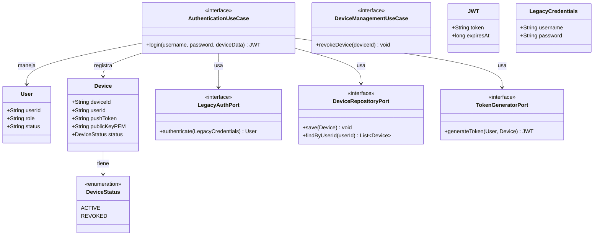

# Domain Model: B-01 (U-IAM / Core Auth & Enclave Registry)

## Entidades y Agregados
- **User:** Representa la identidad corporativa validada.
- **Device:** Representa el dispositivo físico. Almacena la llave pública del Enclave (`publicKeyPEM`) y el token para notificaciones (`pushToken`).
- **DeviceStatus:** Enum para controlar si un dispositivo está `ACTIVE` o `REVOKED`.

## Value Objects
- **JWT:** Token de sesión efímero generado internamente.
- **LegacyCredentials:** Objeto de transporte para credenciales que viajan hacia la Capa Anticorrupción (ACL).

## Puertos (Clean Architecture)
- **AuthenticationUseCase (In):** Orquesta el login, delegando la validación al Legado y el registro del dispositivo al repositorio.
- **LegacyAuthPort (Out):** Adaptador hacia el sistema bancario antiguo.
- **DeviceRepositoryPort (Out):** Adaptador de persistencia para guardar dispositivos registrados.
- **TokenGeneratorPort (Out):** Adaptador de generación criptográfica del JWT.

