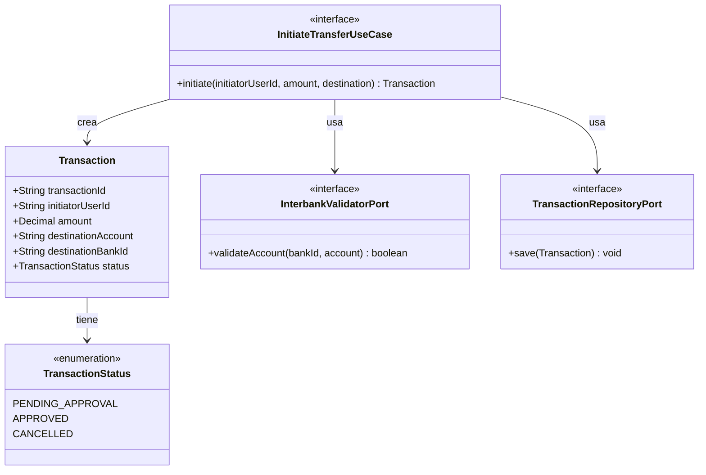

# Domain Model: B-02 (U-TRANS / Transfer State Machine)

## Entidades y Agregados
- **Transaction:** Representa la intención de transferencia.
- **TransactionStatus:** Enum (`PENDING_APPROVAL`, `APPROVED`, `CANCELLED`, `COMPLETED`, `FAILED`).

## Value Objects
- **Money:** Representa la cantidad y moneda.
- **AccountDetails:** Datos de la cuenta destino y banco.

## Puertos (Clean Architecture)
- **InitiateTransferUseCase (In):** Orquesta la creación, valida contra el banco destino y guarda.
- **InterbankValidatorPort (Out):** Adaptador síncrono para verificar que la cuenta destino exista.
- **TransactionRepositoryPort (Out):** Adaptador de persistencia.

