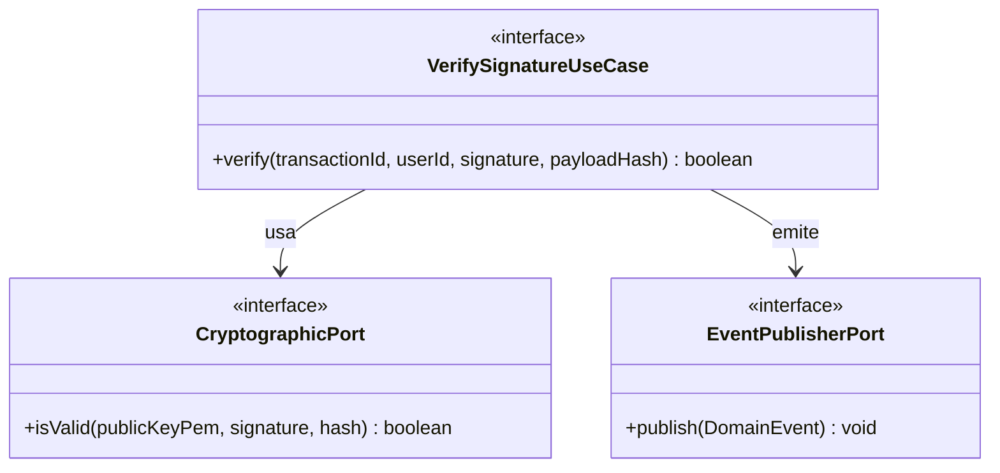

# Domain Model: B-03 (U-TRANS / Multi-sig Cryptographic Engine)

## Entidades y Value Objects
- **Transaction:** Se recupera del repositorio. Su estado debe ser `PENDING_APPROVAL`.
- **SignaturePayload:** Objeto que encapsula la firma Base64 y el hash original.
- **TransferApprovedEvent:** Evento de dominio (Domain Event) que se emite tras el éxito.

## Puertos (Clean Architecture)
- **VerifySignatureUseCase (In):** Caso de uso principal. Recupera la transacción, obtiene la llave pública del dispositivo asociado, valida la firma matemáticamente, aprueba la transacción y emite el evento.
- **CryptographicPort (Out):** Adaptador matemático para verificar algoritmos asimétricos (e.g. SHA256withRSA o ECDSA).
- **DeviceKeyRepositoryPort (Out):** Adaptador para obtener la llave pública (`publicKeyPEM`) original registrada en B-01.
- **TransactionRepositoryPort (Out):** Adaptador para actualizar el estado a `APPROVED`.
- **EventPublisherPort (Out):** Adaptador para publicar eventos de dominio (Pub/Sub).

