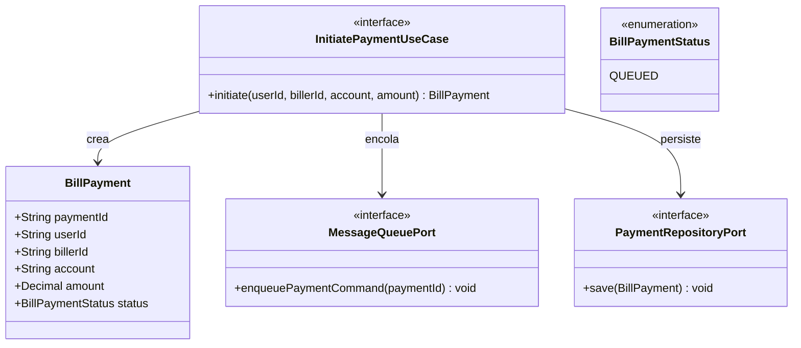

# Domain Model: B-04 (U-PAY / Iniciación de Pagos)

## Entidades y Value Objects
- **BillPayment:** Representa la intención de pagar un servicio público o privado.
- **BillPaymentStatus:** Estado de la transacción en la saga (`QUEUED`, `DEBITING`, `PAYING`, `COMPLETED`, `FAILED`, `COMPENSATING`).

## Puertos (Clean Architecture)
- **InitiatePaymentUseCase (In):** Caso de uso que valida la estructura básica, asigna un ID único y encola el pago.
- **MessageQueuePort (Out):** Adaptador para enviar el mandato de pago a un sistema de colas asíncrono (AWS SQS), desacoplando la API del procesamiento intensivo.
- **PaymentRepositoryPort (Out):** Persistencia inicial con estado `QUEUED`.

