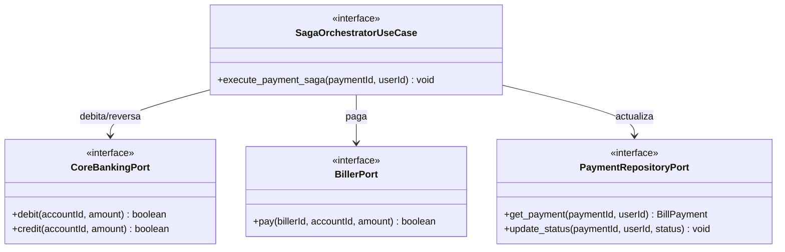

# Domain Model: B-05 (U-PAY / Saga Orchestrator)

## Entidades
- **BillPayment:** Se recupera del repositorio. 
- **BillPaymentStatus:** La máquina de estados transita de `QUEUED` -> `DEBITING` -> `PAYING` -> `COMPLETED`. En caso de fallo transita a `COMPENSATING` y finalmente `FAILED`.

## Puertos (Clean Architecture)
- **SagaOrchestratorUseCase (In):** Caso de uso principal. Orquesta las llamadas secuenciales.
- **PaymentRepositoryPort (Out):** Actualiza el estado de la saga en la base de datos.
- **CoreBankingPort (Out):** Adaptador hacia el banco. Provee métodos `debit()` y `credit()` (reverso).
- **BillerPort (Out):** Adaptador hacia el ente facturador externo. Provee método `pay()`.

